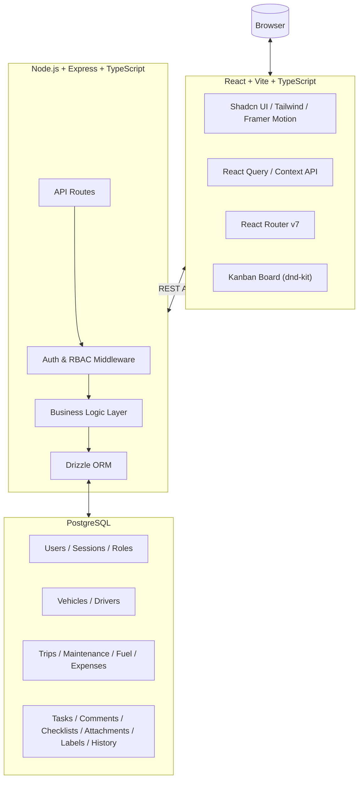

# TransitOps — Smart Transport Operations Platform

A comprehensive, modern ERP and Operations Platform for the Transport and Logistics industry. TransitOps digitizes fleet management, driver coordination, trip tracking, maintenance scheduling, expense logging, and operational task management into a single, intuitive interface.

---

## Architecture



---

## Features

### Fleet Management
- Real-time vehicle roster with status tracking (Available, In-Transit, In-Shop, Retired)
- Vehicle metrics — make, model, capacity, odometer, acquisition cost

### Driver Management
- Driver profiles with license details, categories, and expiry tracking
- Status monitoring (Available, On Trip, Off Duty, Suspended)
- Safety score tracking per driver

### Trip Planning & Tracking
- Dispatch system assigning vehicles and drivers to trips
- Full lifecycle — Draft → Dispatched → In Progress → Completed / Cancelled
- Cargo weight verification against vehicle capacity
- Driver license expiry validation on dispatch
- Automatic fuel log and expense creation on trip completion

### Maintenance & Fuel Logging
- Preventive maintenance records with cost tracking
- Fuel consumption logging per trip and per vehicle

### Operations Kanban Board
Full-featured Kanban board for fleet operations task management.

**Six Columns:** Backlog → Todo → In Progress → Waiting Approval → Blocked → Completed

**Eleven Task Types** — each with its own icon and color:
| Type | Icon |
|---|---|
| Trip | Truck |
| Maintenance | Wrench |
| Inspection | Search |
| Fuel | Fuel |
| Expense | Dollar Sign |
| Driver | Users |
| Vehicle | Car |
| Incident | Alert Triangle |
| Compliance | Shield Alert |
| Document Renewal | File Text |
| General Task | Clipboard Check |

**Priorities:** Low, Medium, High, Critical (Critical cards get a red left-border indicator)

**Per-Card Features:**
- Drag-and-drop between columns via `@dnd-kit`
- Custom labels with color coding
- Assignee avatars
- Due dates with relative formatting ("Today", "3d overdue", "In 2 days")
- Estimated hours
- Integrated entity references (Vehicle, Driver, Trip, Maintenance Log)
- Comment count, attachment count, checklist progress badges

**Task Dialog (Create/Edit):**
- Full form with priority, type, assignee, due date, estimated hours, description
- Labels multi-select
- Comments tab — threaded discussions with author avatars and timestamps
- Checklist tab — add/complete/delete checklist items
- Activity History tab — full audit trail of all changes
- Duplicate and Archive actions

**Search & Filters:**
- Search by title or description
- Filter by status, priority, task type
- Results update in real-time

### Analytics Dashboard
- Interactive charts (Recharts) for expense breakdown, fleet utilization, trip stats
- KPIs: active vehicles, available drivers, fleet utilization percentage
- Kanban dashboard stats: tasks due today, overdue, critical, blocked, completion rate, average completion time, per-column counts, recent activity

### Security & Roles (RBAC)
- JWT authentication with HTTP-only cookies + Bearer token support
- Token refresh with automatic rotation
- Granular role-based permissions per module:
  - **Fleet Manager** — full access
  - **Dispatcher** — create/edit trip tasks
  - **Safety Officer** — compliance task management
  - **Financial Analyst** — expense/fuel task management
  - **Driver** — view-only assigned tasks
  - **Admin** — bypasses all permission checks
- RBAC matrix editable by Admin in Settings

### API Endpoints

| Method | Endpoint | Description |
|---|---|---|
| GET | `/api/tasks` | List tasks (paginated, filterable, searchable) |
| POST | `/api/tasks` | Create a task |
| GET | `/api/tasks/:id` | Get task with all relations |
| PATCH | `/api/tasks/:id` | Update task |
| DELETE | `/api/tasks/:id` | Archive task (soft delete) |
| PATCH | `/api/tasks/:id/status` | Update task status |
| POST | `/api/tasks/:id/duplicate` | Duplicate a task |
| POST | `/api/tasks/:id/comments` | Add comment |
| PATCH | `/api/tasks/:taskId/comments/:commentId` | Edit comment |
| DELETE | `/api/tasks/:taskId/comments/:commentId` | Delete comment |
| POST | `/api/tasks/:id/checklists` | Add checklist item |
| PATCH | `/api/tasks/:taskId/checklists/:checklistId` | Update checklist item |
| DELETE | `/api/tasks/:taskId/checklists/:checklistId` | Delete checklist item |
| POST | `/api/tasks/:id/watchers` | Watch a task |
| DELETE | `/api/tasks/:id/watchers` | Unwatch a task |
| GET | `/api/tasks/dashboard` | Kanban dashboard statistics |
| GET | `/api/tasks/activity` | Recent activity feed |
| GET | `/api/tasks/labels` | List all labels |
| POST | `/api/tasks/labels` | Create a label |

---

## Tech Stack

### Frontend
| Technology | Purpose |
|---|---|
| React 19 + TypeScript | UI framework |
| Vite 8 | Build tool |
| React Router v7 | Client-side routing |
| TanStack React Query 5 | Server state & caching |
| Tailwind CSS 4 + Shadcn UI | Styling & component library |
| Framer Motion 12 | Animations |
| `@dnd-kit` | Drag-and-drop Kanban |
| Lucide React | Icons |
| Recharts | Charts & analytics |
| React Hook Form + Zod | Forms & validation |
| Axios | HTTP client |

### Backend
| Technology | Purpose |
|---|---|
| Node.js + Express 4 | API server |
| TypeScript | Type safety |
| Drizzle ORM | Database ORM with migrations |
| PostgreSQL | Relational database |
| JWT + bcryptjs | Authentication |
| Zod | Request validation |

---

## Database Schema

17 tables across 4 domains:

**Auth:** `users`, `sessions`, `role_permissions`

**Fleet:** `vehicles`, `drivers`

**Operations:** `trips`, `maintenance_logs`, `fuel_logs`, `expenses`

**Kanban:** `tasks`, `task_comments`, `task_checklists`, `task_attachments`, `task_labels`, `task_to_labels`, `task_watchers`, `task_history`

---

## Local Setup

### Prerequisites
- Node.js v18+
- PostgreSQL (local or cloud — Supabase, Neon, etc.)

### 1. Clone
```bash
git clone https://github.com/VasoyaViraj/TransitOps.git
cd TransitOps
```

### 2. Backend
```bash
cd backend
npm install
cp .env.sample .env   # Add DATABASE_URL and JWT_SECRET
npm run db:push        # Push schema to database
npm run db:seed        # (Optional) seed demo data
npm run dev            # http://localhost:3000
```

### 3. Frontend
```bash
cd frontend
npm install
cp .env.sample .env   # Set VITE_API_URL=http://localhost:3000/api
npm run dev            # http://localhost:5173
```

### Login Credentials (seeded)
| Role | Email | Password |
|---|---|---|
| Admin | admin@transitops.com | password123 |
| Fleet Manager | manager@transitops.com | password123 |
| Dispatcher | dispatcher@transitops.com | password123 |
| Safety Officer | safety@transitops.com | password123 |
| Financial Analyst | finance@transitops.com | password123 |

---

## Future Roadmap

- **GPS Integration** — real-time vehicle tracking on live map
- **Mobile App** — React Native app for drivers
- **AI Route Optimization** — fuel-efficient routing with traffic/weather data
- **Automated Alerts** — SMS/email notifications for delays, maintenance, expirations
- **Kanban Automation** — auto-create tasks from vehicle maintenance, license expiry, insurance renewal, trip cancellations, inspections, and safety score thresholds

---

## Team

| Name | Role |
|---|---|
| **Viraj Vasoya** | Full-Stack Developer |
| **Aayush Parekh** | Full-Stack Developer |
| **Dev Desai** | Full-Stack Developer |

Built with ❤️ for Hackathon.
